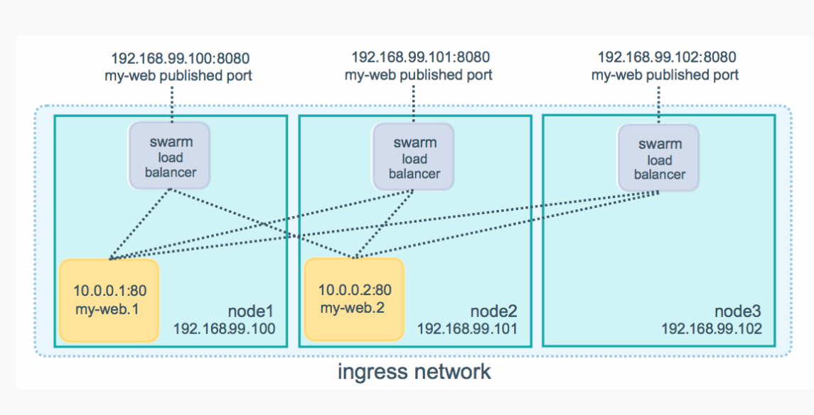

# 安装好docker

yum search docker
yum install -y docker
systemctl start docker
systemctl status docker

# 加入开机自启

systemctl enable docker

# 更改镜像源

vi /etc/docker/daemon.json
{
"registry-mirrors": ["http://hub-mirror.c.163.com"]
}
或
{
"registry-mirrors": ["https://docker.mirrors.ustc.edu.cn"]
}
# 重 启
systemctl restart docker.service

# 关 闭SELinux 

[root@swaram01 ~]# getenforce
Disabled
[root@swaram01 ~]# /usr/sbin/sestatus -v
SELinux status:                 disabled

vi /etc/selinux/config
将SELINUX=enforcing改为SELINUX=disabled 

# 编辑hosts文件
vi /etc/hosts  
192.168.182.110 swarm01  
192.168.182.111 swarm02  

# 关闭防火墙
systemctl stop firewalld.service #停止firewall
systemctl disable firewalld.service #禁止firewall开机启动

# 修改监听端口
vim  /lib/systemd/system/docker.service  

-H tcp://0.0.0.0:2375 -H unix:///var/run/docker.sock

# 重启docker服务
systemctl daemon-reload    ##使配置文件生效
systemctl restart docker  


# 安装swarm
docker pull swarm  

# manager上初始化swarm
docker swarm init --advertise-addr  【manager主机ip】

# 添加集群节点
SWMTKN 和 后面的ip都是从manager拿的
docker swarm join --token SWMTKN-1-55074oer8dieyfkpistpv7qy9ig0a0rczopkqq7cwg9y8ob3ot-3zg990p4hdr93k1l2j6uhts93 192.168.29.128:2377

# 查看集群状态
docker info
```text
Containers: 2
Running: 0
Paused: 0
Stopped: 2
Swarm: active
  NodeID: dxn1zf6l61qsb1josjja83ngz
  Is Manager: true
  Managers: 1
  Nodes: 1
```

# 查看节点信息
docker node ls

# 部署服务
```shell
docker service create --replicas 1 --name helloworld alpine ping docker.com
```
--name 标志将服务命名为 helloworld
--replicas 标志指定1个运行实例的所需状态。
alpine是镜像名
# 检查服务

## 查看正在运行的服务列表
```shell
docker service ls
```

## 查看服务详细信息
```shell
docker service inspect --pretty <SERVICE-ID>
```
例如 ：
```shell
docker service inspect --pretty helloworld
```
--pretty 简化阅读格式，不带就返回json格式

## 查看那些节点在运行该服务
```shell
docker service ps <SERVICE-ID>
```
例如 ：
```shell
docker service ps helloworld
```

# 扩展和缩小服务

## 扩展服务
```shell
docker service scale <SERVICE-ID>=<NUMBER-OF-TASKS>
```
例如：
```shell
docker service scale helloworld=5

helloworld scaled to 5
```
通过命令验证：
```text
[root@senergy-01 ~]# docker service ps helloworld
ID             NAME           IMAGE           NODE         DESIRED STATE   CURRENT STATE            ERROR     PORTS
olg5v18eb4nk   helloworld.1   alpine:latest   senergy-03   Running         Running 19 minutes ago             
kezfp05hsr6x   helloworld.2   alpine:latest   senergy-02   Running         Running 46 seconds ago             
tfsa956nvadv   helloworld.3   alpine:latest   senergy-01   Running         Running 46 seconds ago             
l8bs7f93zy3y   helloworld.4   alpine:latest   senergy-01   Running         Running 46 seconds ago             
2yx9l7hqtdtn   helloworld.5   alpine:latest   senergy-03   Running         Running 48 seconds ago 
```

## 缩小服务
```shell
docker service scale helloworld=2
````
通过命令验证：
```text
[root@senergy-01 ~]# docker service ps helloworld
ID             NAME           IMAGE           NODE         DESIRED STATE   CURRENT STATE            ERROR     PORTS
y7t7xol20msq   helloworld.1   alpine:latest   senergy-03   Running         Running 51 seconds ago             
ahjc3j7y97qc   helloworld.2   alpine:latest   senergy-03   Remove          Running 7 seconds ago              
68y8cjs2oorr   helloworld.3   alpine:latest   senergy-02   Running         Running 34 seconds ago             
xtlefmkxzhbp   helloworld.4   alpine:latest   senergy-01   Remove          Running 7 seconds ago              
at93s7hsaox8   helloworld.5   alpine:latest   senergy-01   Remove          Running 7 seconds ago       
```
有3个服务被remove


# 删除服务
```shell
docker service rm <SERVICE-ID>
```
执行完不会马上删除服务，会有一定延迟时间，但不会很久


# 滚动更新服务
暂时用不到

# 集群模式路由网格

## 为服务发布端口
```shell
docker service create \
  --name <SERVICE-NAME> \
  --publish published=<PUBLISHED-PORT>,target=<CONTAINER-PORT> \
  <IMAGE>
```
例如:
这将在集群中发布两个服务，并且都发布的端口都是8080，
访问任何节点上的端口8080时，Docker会将您的请求路由到存活的容器
```shell
docker service create \
  --name my-web \
  --publish published=8080,target=80 \
  --replicas 2 \
  nginx
```


## 为已存在的容器发布端口
```shell
docker service update \
  --publish-add published=<PUBLISHED-PORT>,target=<CONTAINER-PORT> \
  <SERVICE>
```
例如：
```shell
docker service update \
  --publish-add published=6789,target=6789 \
  helloworld
```
为正在运行的helloworld服务发布一个端口
可以使用 docker service inspect 查看服务的已发布端口

##  绕过路由网格
```shell
docker service create --name dns-cache \
  --publish published=53,target=53,protocol=udp,mode=host \
  --mode global \
  dns-cache
```
需要设置 mode=host 

##  负载均衡策略
swarm 提供2种负载均衡策略 vip & dnsrr
vip使用虚拟ip
dns简单粗暴使用容器ip

## 